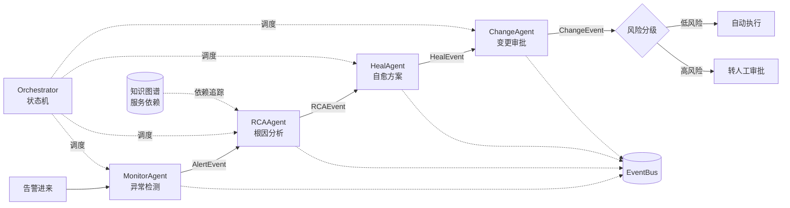

# Multi-Agent AIOps 故障处置系统

用 4 个职责分离的 Agent + 事件总线 + 状态机编排，把「告警 → 根因 → 自愈 → 审批」这条运维处置链路自动化。Python + FastAPI 实现，可本地一键运行，也提供 Kafka / 生产化扩展路径。

> 项目背景：为深入理解多 Agent 协作、事件驱动架构与 AIOps 故障处置链路而实现的一套可运行系统。所有 Agent 逻辑、编排器、事件总线、知识图谱与 API 均为本项目代码。

## 为什么需要它

传统运维有两个典型痛点：

- **告警多、误报高**：每天几百条告警，大部分重复或无关，人工筛选成本极高。
- **排障慢**：从告警产生到定位根因、再到执行修复，平均要几十分钟，且高度依赖个人经验。

本系统把这段流程拆给 4 个 Agent，每个 Agent 只做一件事，彼此通过事件对象通信，由编排器决定「谁先跑、谁跳过、谁重试」。

## 系统架构



## 四个 Agent 各做什么

| Agent | 职责 | 关键实现 |
|---|---|---|
| **MonitorAgent** | 判断告警是真异常还是误报 | 3-Sigma / EWMA / Isolation Forest 三算法投票；fingerprint 去重；按分数分级 |
| **RCAAgent** | 定位根因 | 沿服务依赖反向 BFS 找根因候选 → 收集指标/近期变更/严重度证据 → 贝叶斯置信度 |
| **HealAgent** | 生成并执行修复方案 | 按 RCA 建议匹配 Playbook，走「爆炸半径检查 → 熔断器检查 → dry-run → 执行/审批」 |
| **ChangeAgent** | 判断修复操作是否安全 | 加权风险分模型；低风险自动审批、高风险转人工；每次操作写审计日志 |

## 核心设计

### 1. 事件驱动解耦：Agent 之间不互相调用

`core/event_bus.py` 定义了统一抽象，Agent 只认接口不认实现：

```python
class EventBus(ABC):
    async def publish(self, topic: str, event: BaseModel) -> None: ...
    async def subscribe(self, topic: str, group_id: str, handler: Callable) -> None: ...
```

提供两个实现，用工厂方法切换：

- `InMemoryEventBus` —— 本地开发与测试用，零外部依赖，保留完整事件日志便于调试。
- `KafkaEventBus` —— 生产路径，带发布重试（`acks=all` + `retries`）、手动 commit、**死信队列**（处理失败自动投递到 `<topic>.dlq`）。

```python
event_bus = create_event_bus(use_kafka=False)
```

同一次故障产生的所有事件共享 `correlation_id`，可完整追踪链路。

### 2. 状态机编排：条件路由 + 失败重试 + 检查点

`core/orchestrator.py` 不是简单的线性 pipeline，每个节点带执行条件、重试上限和状态：

```python
WorkflowNode(name="rca",  agent=rca,  condition=lambda s: s.alert_event is not None)
WorkflowNode(name="heal", agent=heal, condition=lambda s: s.rca_event is not None
                                                and s.rca_event.confidence >= 0.3)
```

- **条件路由**：上一步没有产出（或置信度不足）就跳过后续节点，不做无意义的连锁动作。
- **失败重试**：单节点异常自动重试，默认上限 3 次，重试耗尽才标记 `FAILED`。
- **检查点**：每个节点结束后深拷贝保存状态，可通过 `get_checkpoint(incident_id)` 恢复。
- **可观测**：`get_workflow_status()` 输出每个节点的状态、重试次数与该 Agent 的运行指标（处理数、错误数、平均延迟）。

### 3. 异常检测：三个算法投票降误报

`models/time_series.py` 实现三种互补算法，覆盖不同异常形态：

| 算法 | 适用形态 |
|---|---|
| 3-Sigma | 近似正态指标的**突变** |
| EWMA | 对近期数据更敏感的**缓慢漂移** |
| Isolation Forest | 不假设分布的多维异常 |

`EnsembleDetector(min_votes=2)` 要求**至少 2 个算法判定异常**才报警，这是把误报压下来的关键。

### 4. 知识图谱 + 反向 BFS 定位根因

`core/knowledge_graph.py` 维护服务依赖关系：

```text
order-service --DEPENDS_ON--> payment-service --DEPENDS_ON--> mysql-primary
```

核心算法 `reverse_bfs_trace`：从告警服务出发沿依赖反向遍历，找到**没有下游依赖的叶子节点**作为根因候选，并计算影响面分数。生产环境可替换为 Neo4j + Cypher 多跳查询。

### 5. 安全护栏：自愈不能变成二次故障

自愈是最容易出事的环节，因此 `HealAgent` 强制执行四级检查：

```text
爆炸半径检查 → 熔断器检查 → dry-run 预演 → 执行 / 等待审批
```

分级策略：

- **L0** 低风险 → 全自动执行
- **L1** 回滚等操作 → 需 oncall 确认
- **L2** 高影响操作 → 需 TL 审批

`ChangeAgent` 用加权模型算出风险分决定走自动还是人工：

```text
risk = 0.30*爆炸半径 + 0.25*操作风险 + 0.20*时间风险 + 0.15*历史风险 + 0.10*服务关键度
```

## 快速开始

```bash
cd python
pip install -r requirements.txt

# 方式一：命令行 Demo（无需启动服务）
python -m core.orchestrator

# 方式二：启动 FastAPI
python -m uvicorn api.main:app --reload --port 8000
```

启动后打开 http://localhost:8000/docs 查看交互式 API 文档。

## API 一览

| 方法 | 路径 | 说明 |
|---|---|---|
| `POST` | `/api/v1/incidents/trigger` | 触发一次完整故障处置流程 |
| `GET` | `/api/v1/incidents` | 历史故障记录（最近 50 条） |
| `GET` | `/api/v1/incidents/{incident_id}` | 单次故障详情 |
| `GET` | `/api/v1/topology` | 服务拓扑总览 |
| `GET` | `/api/v1/topology/{service}/dependencies` | 指定服务的依赖、被依赖、影响面与依赖路径 |
| `POST` | `/api/v1/anomaly/detect` | 对自定义指标序列做集成异常检测 |
| `GET` | `/api/v1/anomaly/demo` | 注入异常并观察检测效果 |
| `GET` | `/api/v1/agents/status` | 工作流节点状态与 Agent 运行指标 |
| `GET` | `/health` | 健康检查 |

## 运行效果

`python -m core.orchestrator` 会打印完整处置链路：

```text
[告警] high_cpu_usage on order-service
[根因分析] 近期代码部署引入性能退化, confidence=0.54
[自愈] rollback, L1, blast_radius=0.15
[审批] approved by oncall-engineer, risk=0.158
状态: resolved
```

## 测试

```bash
cd python
pytest
```

覆盖：完整工作流能跑到 `resolved`、节点顺序为 monitor→rca→heal→change、触发时携带的指标元数据不丢失、知识图谱能追踪依赖、集成检测器能发现注入的异常点。

## 目录结构

```text
python/
├── models/       # 事件模型（AlertEvent/RCAEvent/HealEvent/ChangeEvent/IncidentState）+ 时序异常检测
├── core/         # 事件总线 + 知识图谱 + 状态机编排器
├── agents/       # BaseAgent 抽象 + 4 个 Agent 实现
├── api/          # FastAPI 入口与请求/响应模型
├── config/       # pydantic-settings 配置 + prometheus.yml
├── tests/        # pytest 用例
├── docker-compose.yml
├── pytest.ini
└── requirements.txt
```

`BaseAgent` 用模板方法模式统一了所有 Agent 的外壳（埋点、计时、异常捕获、指标统计），子类只需要实现 `process(state)`。

## 技术栈

Python 3 · FastAPI · Uvicorn · Pydantic v2 · NumPy · scikit-learn · pytest / pytest-asyncio · Kafka（可选）

## 后续可扩展方向

- 把 `InMemoryEventBus` 换成 Kafka、`InMemoryKnowledgeGraph` 换成 Neo4j，即对应生产形态。
- 给 `HealAgent` 接入真实执行器（kubectl / Ansible），当前为 dry-run 模式。
- 让 `RCAAgent` 接入大模型解析非结构化日志。
- 暴露 Prometheus 指标，监控 Agent 自身的延迟与成功率。
